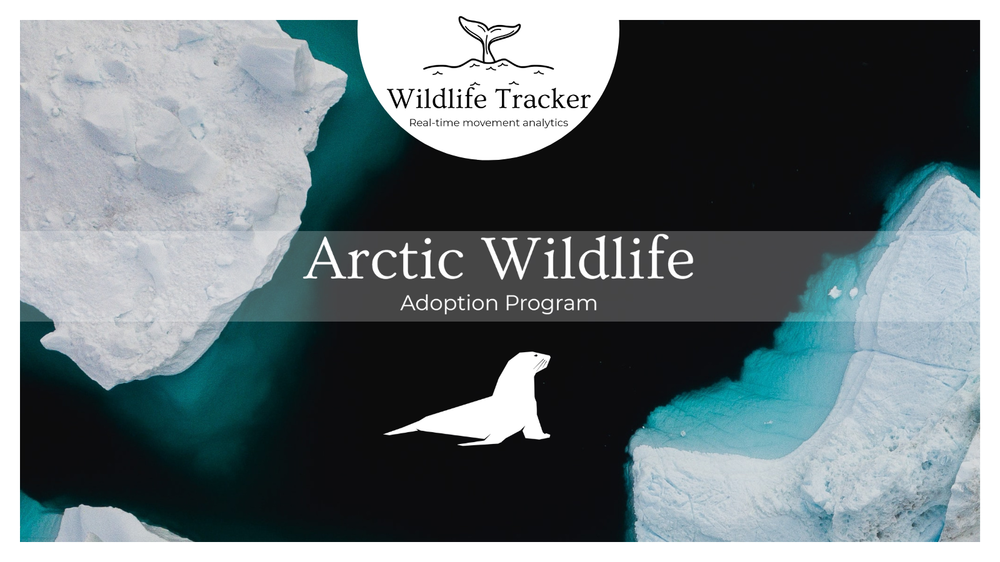
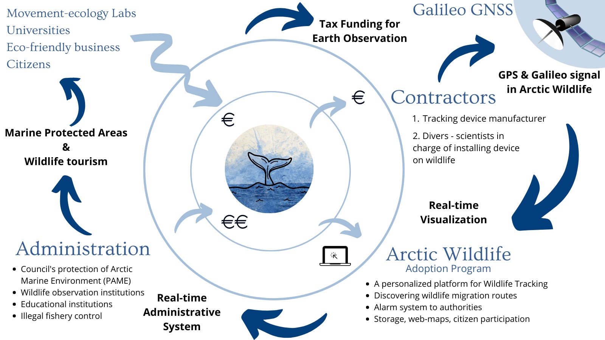

*To cite this material*

# Arctic Wildlife Adoption Program
## [wwww.gis4-wildlife.com](wwww.gis4-wildlife.com)

This Repo contains the webmaps developed at the Cassini Hackathon 2021, in Finland. Project "Wildlife Tracker for Arctic: Initiative of Arctic wildlife adoption program". It focuses in the adoptions of Arctic wildlife from society. People can access to purchase tags and place them on animals that are migrating to the Artic. The purpose is to promote the wildlife protection and the safety of these animals in their migration routes that are affected by shipping routes.

The conservation of wildlife is done by a blue economic circular model developed by Wildlife Tracker team during the Hackathon. The cycle starts when citizens or research labs purchase tags for wildlife. Wildlife Tracker access to services from coastal communities by contracting their services to install the devices on animals. Then the cycle continue when Wildlife Tracker Community access to platform with their adopted animal and can follow their migration routes. This data as input complement the next stage which is the database of Wildlife Tracker Administration. Authorities can use the Administrative Version to promote the creation of Marine Protected Areas and Wildlife observation tourism, as well as controlling the illegal Fishery and accidental collision of wildlife. The cycle is closed when citizens can access to this new delimitation of Protected Areas assessed as a public service.

Wildlife Tracker platform is able to track animals in real time visibility. It is connected to a database that receives live feeds from **satellite constellations like Argos, Icarus, Iridium, GSM, and Galileo GNSS**. As special features it contains a geofence alarm and movement analysis algorithms. The geofence can be chosen from client and it can be used when wildlife is entering to high pressure fishery zone or going out of their marine sanctuary. In case you want to know more and see online demos contact us in your website. [www.gis4-wildlife.com](www.gis4-wildlife.com)

# Wildlife Tracker Community - Online demo (reserved)
The client version requires Wildlife Tracker Community credentials. Be in touch if you want to see online demos of Community or Administrative version.

If you want to know about the admin version feel free to send a message to us.
You can open web maps as products of the geo-frameworks.

## [Wildlife Tracker Community (Web map product)](https://gis4-move-analysis.github.io/arctic-wildlife-adoption-program/root/Great_Fin_adopted_index-True.html)
This demo contains the visualization of the Wildlife Tracker Community version. It has 5 Whales adopted that migrate to the Artic Region through the Norwegian Sea and Greenland. The Great Whales started their journey in Azores Islands and Fin Whales started from Arctic untill Coastal Portugal.

## [Wildlife Tracker Administration (Web map product)](https://gis4-move-analysis.github.io/arctic-wildlife-adoption-program/root/Great_Fin_norm_index-True.html)
This demo contains the visualization of the Wildlife Tracker Administration version. It has 33 Whales in total from the Administration side. The idea is that adminsitrative version keeps track of all the wildlife individuals adopted by community. 15 Great Whales starting their journey from Azores Islands and 18 Fin Whales starting from North to Coastal Portugal

## [Wildlife Tracker Administration + M3 ship data agreggation model (Web map product)](https://gis4-move-analysis.github.io/arctic-wildlife-adoption-program/root/Great_Fin_m3Model_index-True.html)
This demo contains the visualization of the Wildlife Tracker Administration version. It has 33 Whales and an additional layer that reflects the the intensity of Fishery Activity. The model aggregate trajectory data into a point grid that shows where and in how much intensity the ships stop in ocean to fish. In orange color, you will see the areas where Fishing Industry is taking activity in ocean and how it overlaps with whales migration routes. The zone computed is only for Norwegian Sea but the optimistic plan is to complete this model processing to the whole Arctic Region in real time approach.

# References
- [Graser et al, 2020. The M³ massive movement model: a distributed incrementally updatable solution for big movement data exploration](https://www.tandfonline.com/doi/abs/10.1080/13658816.2020.1776293)
- [Lydersen et al, 2020 Autumn movements of fin whales (Balaenoptera physalus) from Svalbard, Norway, revealed by satellite tracking](https://www.nature.com/articles/s41598-020-73996-z)
- [Silva et al, 2014 Assessing Performance of Bayesian State-Space Models Fit to Argos Satellite Telemetry Locations Processed with Kalman Filtering](https://www.researchgate.net/publication/260996651_Assessing_Performance_of_Bayesian_State-Space_Models_Fit_to_Argos_Satellite_Telemetry_Locations_Processed_with_Kalman_Filtering)
