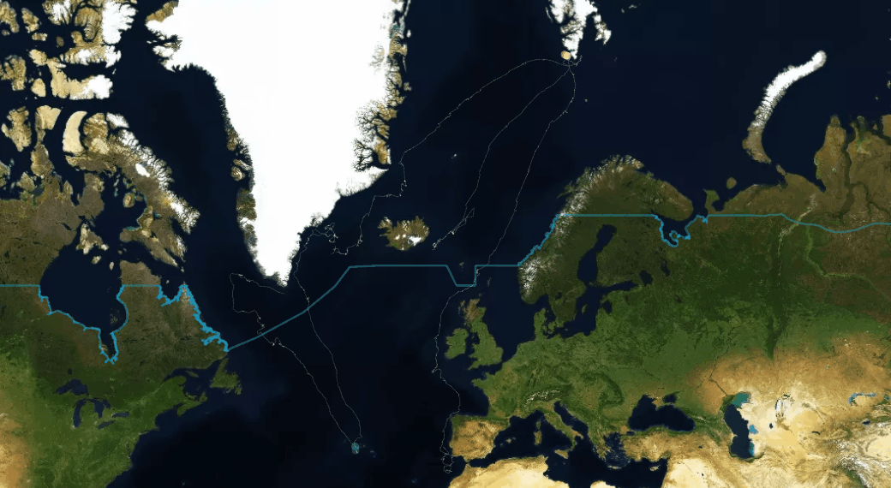
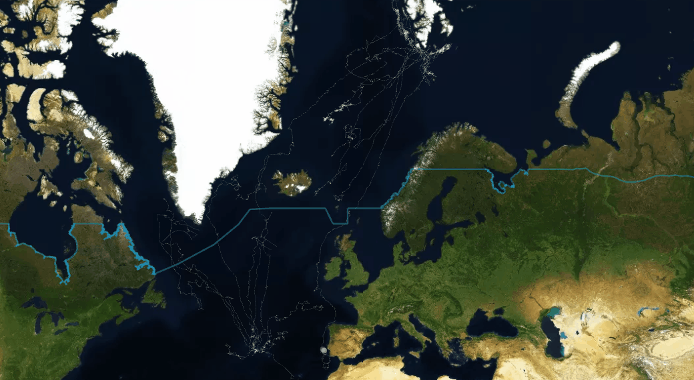
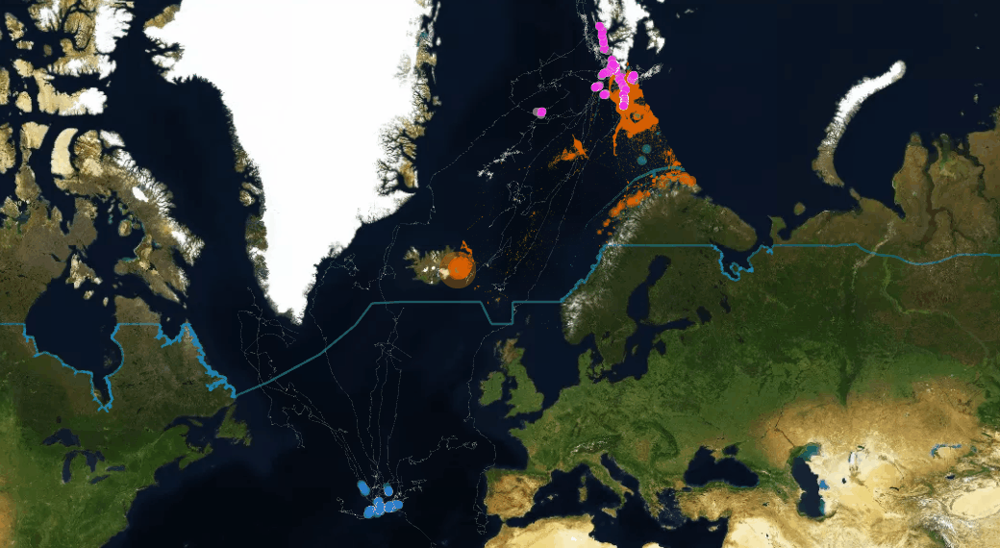
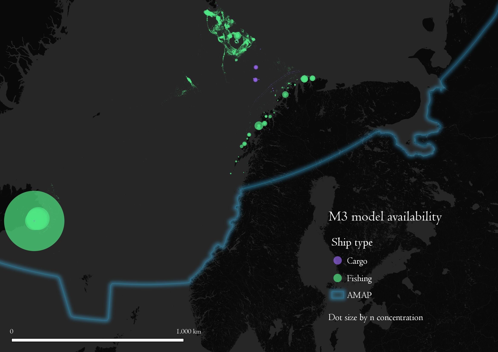
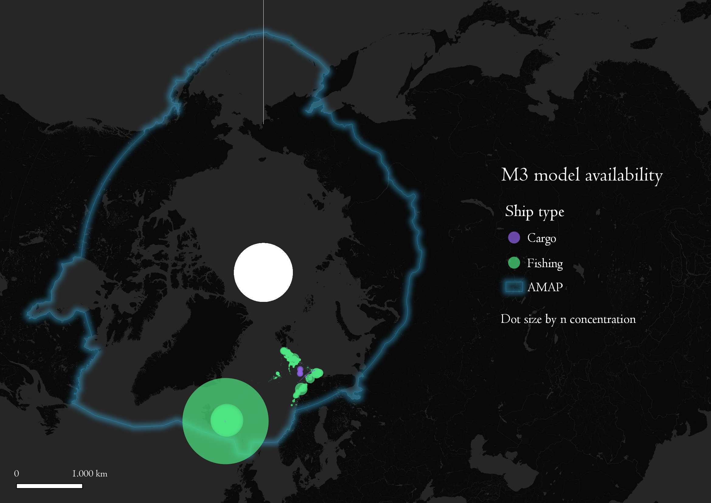

# Arctic Wildlife Adoption Program
## [wwww.gis4-wildlife.com](wwww.gis4-wildlife.com)

This Repo contains the webmaps developed at the Cassini Hackathon 2021, in Finland. Project "Wildlife Tracker for Arctic: Initiative of Arctic wildlife adoption program". It focuses in the adoptions of Arctic wildlife from society. People can access to purchase tags and place them on animals that are migrating to the Artic each year. The purpose is to promote the wildlife protection and the safety of these animals in their migration routes.

Wildlife Tracker platform is able to track animals in real time visibility. It is connected to a database that receives live feeds from **satellite constellations like Argos, Icarus, Iridium, GSM, and Galileo GNSS**. Additionally, the visualization framework is updated each 15 minutes to keep visualization always up to date. As special features it contains a geofence alarm. The geofence can selected from client and it can be used when wildlife is entering to high pressure fishery zone or going out of their marine sanctuary. In case you want to know more and see online demos contact us in your website.

If you have credentials to Wildlife Tracker you can access directly to the Wildlife Tracker Community version in the next link:

## [Wildlife Tracker Community Online Framework](https://share.streamlit.io/bryanvallejo16/wildlife-tracker-adoption-0.1/main/gis4-adoption.py)

If you want to know about the admin version feel free to send a message to us.
If you don't have Wildlife Tracker credentials you can open web maps as products of the geo-frameworks.

# Wildlife Tracker Community (Demo)
This demo contains the visualization of the Wildlife Tracker Community version. It has 5 Whales adopted that migrate to the Artic Region through the Norwegian Sea and Greenland. The Great Whales started their journey in Azores Islands and Fin Whales started from Arctic untill Coastal Portugal.

# Wildlife Tracker Administration (Demo)
This demo contains the visualization of the Wildlife Tracker Administration version. It has 33 Whales in total from the Administration side. The idea is that adminsitrative version keeps track of all the wildlife individuals adopted by community. 15 Great Whales starting their journey from Azores Islands and 18 Fin Whales starting from North to Coastal Portugal

# Wildlife Tracker Administration + M3 ship data agreggation model (Demo)
This demo contains the visualization of the Wildlife Tracker Administration version. It has 33 Whales and an additional layer that reflects the the intensity of Fishery Activity. The model aggregate trajectory data into a point grid that shows where and in how much intensity the ships stop in ocean to fish. In orange color, you will see the areas where Fishing Industry is taking activity in ocean and how it overlaps with whales migration routes. The zone computed is only for Norwegian Sea but the optimistic plan is to complete this model processing to the whole Arctic Region in real time approach.

